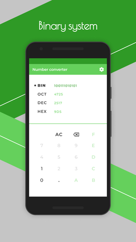
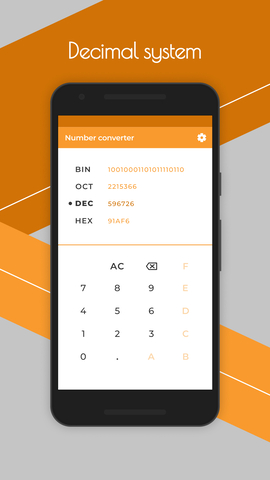

# **Number converter**
This is an Android application for converting integer and fractional numbers to binary, octal, decimal and hexadecimal number systems. Easy to use, intuitive design, diverse selection of design themes.

## **Download**
[Google Play](https://play.google.com/store/apps/details?id=com.m_vetall.numberconverter)

## **Features**
+ Convert numbers from one numerical system to another (binary, octal, decimal, and hexadecimal).
+ Choose between light or dark theme.
+ Choose between four design theme.
+ Choose between English and Ukrainian languages.
+ Copy results to the clipboard.

## **Technologies**
+ Kotlin 
+ Clean Architecture
+ MVVM
+ Koin
+ Preference

## **Usage**
1. Select the initial number system to enter.
2. Enter the number to convert.
3. View the converted number in different number systems.
4. If necessary, copy result to the clipboard.
5. To change the app language, go to Settings and select the desired language.
6. To change the app theme, go to Settings and select the desired theme.

## **Screenshots**
    
